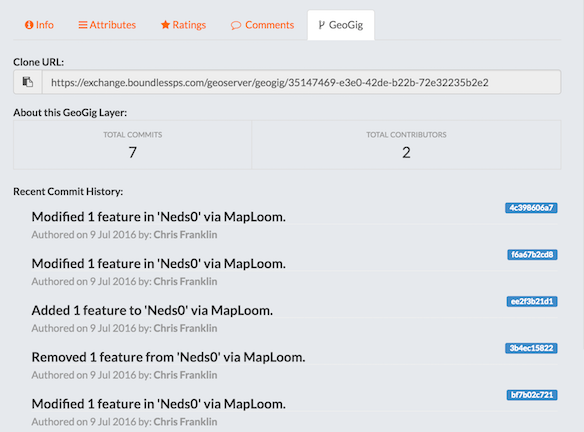
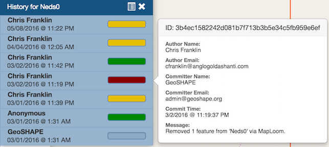
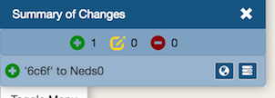
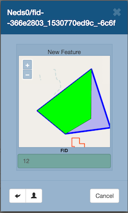

## Editing and Version Management

### Edit Features
Vector layers can be set up so that they’re editable. If you have permissions to edit a layer, the editing tools will be available in the map. If a layer is a GeoGit layer, then you can work with the edit history as well.

####Add a simple point feature to a layer
A layer that is able to be edited will have the __Add Feature__  button available.

1. Click the Add Feature button . The Drawing Geometry dialog will appear at the top of the map.

    

2.  Click on the map to add the geometry. A simple point is placed with one click. Information on editing other types of features can be found in the follow on sections.

    

3. Click the __Accept Feature__ button  to keep the geometry. Click the __Cancel Feature__  button to remove the added feature.

4. After the feature is accepted, the Edit Attributes window will open. Fill out the fields, or select values from the dropdowns to add attribute values.

    

5. Click the Save button at the bottom of the form to save the feature to the layer.

####Add a multiple point feature to a layer
Multipoint features can have more than one point per feature.

1. Click the __Add Feature__ button . The Drawing Geometry dialog will appear at the top of the screen.

2. Click the map to add the first point. Click the Add Geometry button to add another point. Add additional points as needed.
    

3. Click the __Accept Feature__  button to add the geometries to the layer.

4. After the features are accepted, the Edit Attributes window will open. Fill out the fields, or select values from the dropdowns to add attribute values.

5. Click the Save button at the bottom of the form to save the feature to the layer.

####Add a polygon feature to a layer
A simple polygon layer has a single polygon per feature.

1. Click the __Add Feature__  button. The Drawing Geometry dialog will appear at the top of the screen.

2. Click on the map to begin adding the polygon. Continue to click to add all of the vertices. To finalize the polygon, close the geometry by clicking on the first vertice again.

    

3. Click the Right Angles button to create right angle corners on your polygon.

    

4. Click the __Accept Feature__  button to add the geometries to the layer.

5. After accepting the feature, populate the attributes in the Edit Attributes window with any required information.

    

6. Click the __Save__ button to save your changes.

####Add a multipoylgon feature to a layer
A multipolygon layer has one or more polygons per feature. A couple of examples of multipoygons are the U.S. States of Michigan and Hawaii.

1. Click the __Add Feature__  button. The Drawing Geometry dialog will appear at the top of the screen.

2. Click on the map to start drawing the polygon. Continue clicking additional points on the map to add all of the vertices. To close the polygon, click on the first vertice again. To add another polygon, click on the Add Geometry button. Repeat the process to add polygons as needed.

    

3. Click the Right Angles button to create right angle corners on your polygon(s).

    

4. Click the __Accept Feature__ button to add the geometries to the layer.

    

5. After accepting the feature, populate the attributes in the Edit Attributes window with any required information.

    

6. Click the __Save__ button to save your changes.

####Add a line to a layer
A line layer consists of lines that represent features - such as roads, powerlines, and other features.

1. Click the __Add Feature__  button. The Drawing Geometry dialog will appear at the top of the screen.

2. Click on the map to begin drawing the linear feature. Click additional points to add all of the vertices. Double-click the last vertice to finish drawing the line.

    

3. Click the __Accept Feature__  button to add the geometries to the layer.

4. After accepting the feature, populate the attributes in the Edit Attributes window with any required information.
    

5. Click the __Save__ button to save your changes.

####Add a multiline to a layer
A multiline layer has one or more polygons per feature.

1. Click the __Add Feature__  button. The Drawing Geometry dialog will appear at the top of the screen.

2. Click on the map to begin drawing a linear feature. Click additional points to add all of the vertices. Double-click the last vertice to finish drawing the line. To add another line, click the Add New LineString Geometry to MultiLineString button.

    

3. Click the Accept Feature button to accept the geometries.

    

4. After accepting the features, populate the attributes in the Edit Attributes window with any required information.
    

5. Click the __Save__ button to save your changes.

####Edit attributes
You can edit the attributes for any features in an editable layer.

1. Click a feature on the map. The feature info box will appear.

    

2. Click the __Edit Attributes__ button to open the Edit Attributes window.

    

3. Add Attribute information as necessary.

    

4. Click the __Save__ button to save your changes.

####Edit point geometries on the map
Point layers can be one of two types: simple points and multipoints. For simple points, there is one point per feature. Multipoints can have one or more points per feature.

1. Click a point feature on the map to open the feature info box.

2. Click the __Edit Geometry__ button. This will open the __Drawing Geometry__ dialog at the top of the screen. Your selected feature will be highlighted in blue.

    

3. Click and Drag the feature to a new location.

4. Click the __Accept Feature__ button to save the new feature location. Click the __Cancel__ button to cancel your edit.

####Edit point geometry manually
Coordinates for point geometries can also be edited manually. This is useful when you have the coordinates from another source (such as a report).

1. Click a point feature on the map to open the feature info box.

2. Click the __Edit Attributes__ button. The Edit Attributes window will open.

    

3. Click the Location field to edit the point's coordinates.

    

4. Click the __Save__ button to save your changes.

####Edit polygon and line geometries
Any existing features in an editable layer can be modified. If it is a GeoGit layer, the history of all of the edits will be maintained to ensure the provenance of the data.

1. Click a feature on the map to be edited. This will open the feature info box.

2. Click the __Edit Geometry__ button. The __Editing Geometry__ dialog will open.

    

3. Mouse over the geometry to highlight the vertice to edit. Click and drag the vertice to a new location. Repeat to edit any additional vertices.

     __--__ 

4. Click the __Accept Feature__ button to save the new feature location. Click the __Cancel__ button to cancel your edit.

    

###Version Management
GeoGit is a specialized database that was designed for distributed editing and supports collaborative editing of geospatial data. It is designed for vector data (point, line, polygon, etc.). When a layer has been stored in GeoGit, it maintains the history of all of the changes made to the data along with who made the changes and when. Within the web map, you can view the history for a layer and for the features.

####GeoGig tab in Boundless Exchange
GeoGit layers in Boundless Exchange will have a GeoGig tab in addition to the other tabs on the Layer detail page. The history is a list of commits that have been made to the layer.

1. In the Layer detail page, click on the GeoGig tab to see the chronological list of commits.

    

      _Commit history within the GeoGig tab_

2. In order to search through the commit history, type in the search box in the __GeoGig__ tab. You can search for any value in the commit history.

####View layer history
You can view a layer's history from the map.

1. Click the name of the layer you want to view. The menu will expand to show additional layer options.

2. Click on the Show History button. The history will expand.

    

3. To view details about a commit, hover over it with the mouse. The color bar next to the commit indicates the type of edits that were made. Green indicates a new feature was added. Yellow indicates a feature was modified. Red indicates a feature was deleted. A commit can have multiple types of edits. In such cases, the bar will have colors representative of the types of edits that were made.

    

    _History detail for a commit_

4. Click on a commit, and its history will update to show the individual edits within that commit. MapLoom will make one commit per edit. The Arbiter mobile app can upload many edits as one commit.

    

5. Clicking on an edit will bring up a new window, displaying the specific changes that were made. The changes will be highlighted with the same color coding as the commits. Green means something was added. Yellow means the feature was changed. Red means the feature was deleted. In the image below, the feature was added, and so the feature on the map is highlighted in green.

    

####View feature history
In addition to viewing the history of edits on a GeoGit layer, you can also view the history of a feature.

1. Click a feature on the map. The feature details will appear.

2. Click on the __Show History__ button. The history list will expand with the commits that contain changes for that feature.

    

####Summarize history

####Export history
