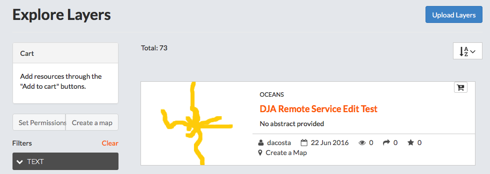
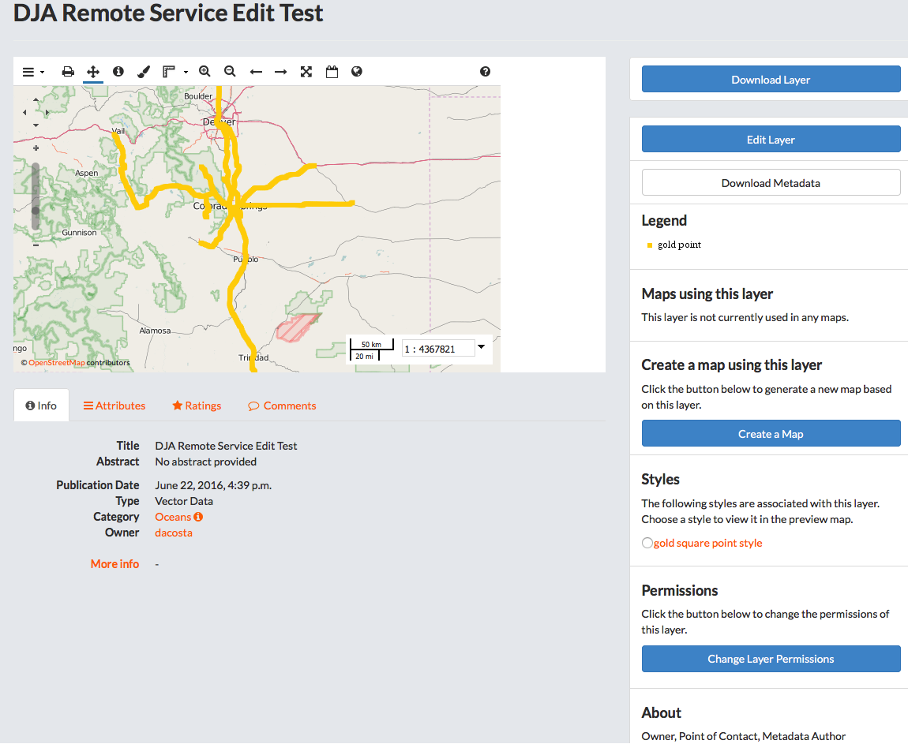
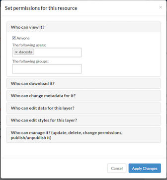
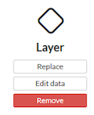
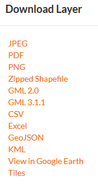
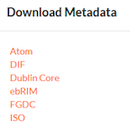

## Working with Layers

Exchange allows you to upload layers. The following are the supported __Vector__ formats:

* ESRI Shapefile
* CSV (Comma Separated Value)
* Google Earth KML
* GeoJSON

The following are the supported __Raster__ formats:

* GeoTIFF
* ERDAS Imagine
* JPEG2000
* NITF (National Imagery Transmission Format)
* CIB (Controlled Image Base)
    * 1 Meter
    * 5 Meter
    * 10 Meter
* CADRG (Compressed Arc Digitized Raster Graphic)
    * GNC (Global Navigation Chart)
    * JNC (Jet Navigation Chart)
    * ONC (Operational Navigation Chart)
    * TPC (Tactical Pilotage Chart)
    * JOG (Joint Operations Graphic)
    * TLM100 (Topographic Line Map 100K)
    * TLM50 (Topographic Line Map 50K)

All of the following filetypes can be uploaded by being placed in a __Zip Archive (.zip)__.

Once the layers are uploaded, they will be available to other users in Exchange.

### Uploading a layer

1. Select the  link on the top toolbar. This will bring up the __Explore Layers page__.

    

2. Select the  button. This will bring up the upload form.

3. Either browse to the files to be uploaded or drag and drop them in the browser. Note that many files consist of multiple files to be complete. If you are uploading an ESRI Shapefile, then you need to include the .dbf, .prj, .shp, and .shx files.

    

4. Click on the  button. This will bring up a local file dialog. Navigate to your data folder and select the files composing the geospatial layer. Note that some data formats consist of multiple files.

5. Exchange has the ability to restrict who can view, edit, and manage layers. On the right side of the page, under __Who can view and download this data?__, select Any registered user. This will ensure that anonymous view access is disabled.

6. In the same area, under __Who can edit data for this layer?__, type a user or users in the field that you want to restrict edit access to. This will ensure that only specific users are able to edit the data in the layer.

    

7. If no destination is selected, the files will be imported into the default spatial data store for Exchange. This will always be the destination for raster data.

    If you have vector data that you want to have time enabled, then check the box for .

    If you have vector data that you want to be versioned, then check the box for . The form will update to provide a dropdown menu for existing GeoGit repositories. To use an existing repository as the destination, select it in the dropdown. In order to import the data into a new GeoGig repository:

    1. type the name of the repository
    2. select that name in the dropdown so it appears in the field.
    

8. Select the  button to upload the data and create a layer. A dialog will display  showing the progress of the upload.

    If you selected , then a new window will open for __Time Options__.

    

    A feature can currently support one or two time attributes. If a single attribute is used, the feature is considered relevant at that single point in time. If two attributes are used, the second attribute represents the end of a valid period for the feature.

    A time attribute can be one of:

    * An existing date
    * Text that can be converted to a timestamp
    * A number representing a year

     
    The 'best guess' will handle date and optional time variants of ISO-8601. In terms of the formatting flags noted above, these are:

    

9. Your layer has been uploaded to Exchange. Now you will be able to access to the its info page (clicking on the  button), access to its metadata edit form (clicking on the  button) or to manage the styles for it (clicking on the  button).

### Layer information
Each layer has an information page associated to it, which has several options for managing the layer’s data. Information is available for the following:

* Info – Displays general information about the layer
*	Attributes
*	Ratings – Based on the ratings of other users
*	Comments – Any comments on the layer from users
*	Legend – Maps using this layer – What other maps within  Exchange are using the layer
* Permissions – How others can see or modify this layer
*	Styles – What styles are associated to the layer
*	About – Provides information on the owner, Point of Contact and Metadata Author

To access Layer Information, click the __Layers__ link on the Exchange toolbar. This will open the Explore Layers page.  Here you will see the list of all of the available layers. Each layer has a thumbnail of the image, as well as the title, author, and any associated keywords.

1. Click the layer title you want to access.

2. The layer's information page will open.

#### Layer Detail Tabs
There are five tabs that have information pertaining to the particular layer: Info, Attributes, Ratings, History and Comments.

1. The Info tab is the default, and displays basic information about the layer, such as the title, who created it, and when it was published.

    

2. The Attributes tab displays the layer attribute table. Layer attribute statistics will only display if the value is a numeric attribute, otherwise, no statistics will be calculated.

    

3. The Ratings tab displays all ratings that have been given to a layer by other users. Click on a star to rate the layer (one to five stars). Click the Cancel this rating icon to delete your rating.

    

4. The Comments tab allows you to see what others are saying about this layer, as well as leave a comment.

    

5. Click the  to leave a comment about the layer.

    

    Click the  button to save comments.

### Editing Metadata and Managing Layers

Each layer’s information page allows you to view the information that makes up the layer. Exchange allows you to edit metadata pertaining to a layer that you have uploaded, as well as any layers you are given permissions to access by other users.

#### Edit Metadata

Metadata is information about the layer, such as the owner, title, purpose or restrictions on a layer. You can include as much information about the layer as you feel is important. The Abstract section is the description that will display in Exchange.

1. Click the  button, and select the edit button under Metadata.

2. The __Edit Metadata__ page will display.
3. Edit the information fields to include anything pertinent to the layer.
4. Click the  button at either the top or bottom of the page to save your changes.

#### Edit Permissions

Layer permissions are established when the layer is first imported, but the administrator/owner of the layer can adjust those permissions as needed. Permissions allow you to manage who can view/download the data, who can make edits, and who can manage the data.

1.	Click the  button.

2.	Set permissions for the resource to give the required access to the layer. Permissions can be granted to Anyone for viewing and downloading, if the checkbox is selected. Edit permissions can be given to registered individuals or groups.

    

3.	Click Apply Changes to save.

#### Manage Styles

Layers can have multiple styles associated to it. The Styles section tells you which style(s) is currently associated to the layer.

1.	Click the  button, and then Manage under Styles.

2.	Click the name of a style in the left-hand list to select it and move it to the right-hand list.
3.	Click a style in the right-hand list, and click the arrows between the lists to remove a style.
4.	Click the Update available Styles button to save changes.

#### Replace a Layer

Replacing a layer allows you to upload a new layer, taking the place of the current later.

1.	Click the  button, and select the Replace button.
    

2.	Follow the instructions to upload a new layer.

#### Remove a Layer

Removing a layer will delete it completely from Boundless Exchange.

1.	Click the  button, and select Remove.

2.	Verify your selection:  .

### Downloading Data from a Layer

Within Exchange, there are two ways to extract data and metadata, download a layer or download a layer’s metadata. This facilitates the flow of geospatial data in (import) and out (export) of Exchange.

#### Download Data

1.	Click the  button.
2.	Select the format in which you’d like the data to be downloaded. Exchange currently offers 12 different formats for use in multiple geospatial platforms.

    

3. Save the file to your computer when the Save As dialog box opens.

#### Metadata

1.	Click the  button.
2.	Select the format in which you’d like to download the metadata.

    
